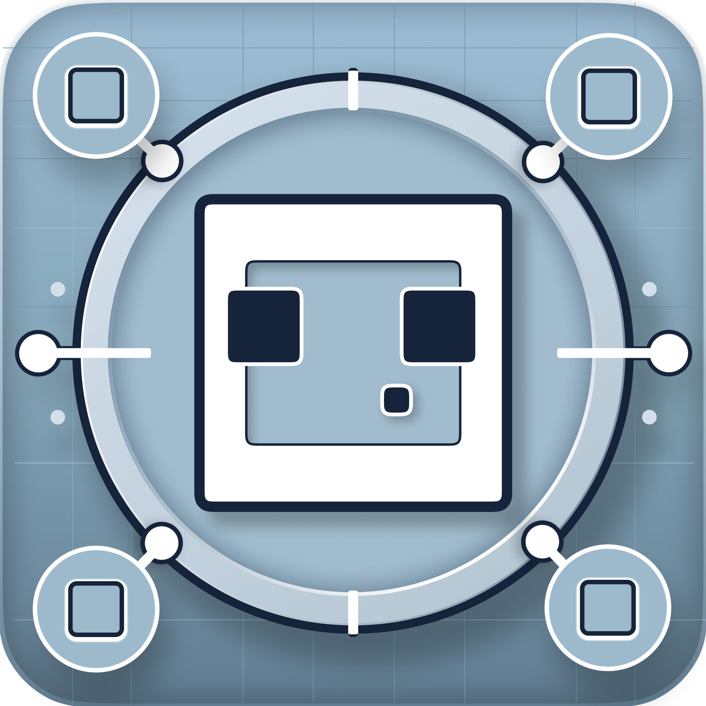

# 史莱姆工坊 · SlimeWorks

**一座属于自己的数字内容工坊。**

图片与影音、小说与漫画、游戏与音乐——所有珍视的内容，都值得一个温柔而有序的家。

---

## ✨ 项目简介

史莱姆工坊（SlimeWorks）是一款**跨平台个人数字内容管理应用**，让图片影音、小说、漫画、游戏与音乐在同一处安家。

它以「节点」为骨架，让多台设备彼此发现、互相服务——无论是在书房的电脑前，还是躺在床上的手机边，你的内容库始终是同一座连贯的图书馆、影音室与游戏厅。

六种内容形态，每一种都被打磨成完整的产品体验；AI 翻译与语音识别、局域网互传、自动更新等能力，则把它们串联为一个有机整体。

## 🧩 功能模块

### 🖼️ 媒体库 — 图片、视频与音频的收藏馆

- 一键扫描本地目录，自动识别图片、视频与音频，以瀑布流或网格温柔呈现；
- 缩略图清晰度五档可调，加载轻快、浏览顺滑；
- **智能文件夹**按文件名规则自动归集内容，收藏、封面与多选管理一应俱全；
- 多设备联合浏览：本机与远程内容的集合在同一界面汇合，大图与视频即点即看、无需等待。

[→ 模块文档](docs/media_library.md)

### 📚 书库与阅读器 — 让长文安静下来

- 支持 **TXT 与 EPUB** 双格式，乱码自动识别，大部头打开也毫无压力；
- 文件夹分组、标签自动整理、排序与阅读进度无缝续读；
- 全文搜索快至瞬间命中，几万本章籍也能一眼寻得；
- 沉浸式阅读器：字号、行距、背景随心调节，章节收藏一键直达；
- **AI 翻译**：选好模型与语言方向，译文如流般逐字浮现，生肉小说就地熟化。

[→ 模块文档](docs/novel_library.md)

### 🎮 游戏库 — 每一小时游玩都被记住

- 手动录入或整目录批量导入，封面与介绍自动从各大资料站补全；
- 启动即计时：游玩时长、会话记录、进度备注全程自动留存；
- 分类管理与统计面板，今日玩了什么、玩多久，一目了然；
- 支持备份导出与导入，游戏记忆随身携带。

[→ 模块文档](docs/game_library.md)

### 📖 Manga 漫画 — 完整的阅读与下载闭环

- 推荐、排行、搜索、详情、收藏与评论，追番所需的一切都在这里；
- 阅读器沉浸模式专为长夜准备，搜索历史与屏蔽词让找书更心无旁骛；
- **下载管理器**离线追番，观看记录自动留存；
- 多条访问通道智能分流并支持一键测速，哪里最快就走哪里。

[→ 模块文档](docs/manga.md)

### 🎵 音乐播放器 — 黑胶转动的听觉角落

- 黑胶唱片动效、波形进度条与沉浸式全屏播放，音乐也值得仪式感；
- **十段均衡器**与预设，调出属于你的声音形状；
- 内嵌封面自动提取，CUE 分轨无损呈现整张专辑；
- 集成**语音识别**能力：ASMR 与有声内容可自动转录并生成时间轴。

[→ 模块文档](docs/music_player.md)

### 🔗 节点服务器 — 多设备内容的分布式底座

- 桌面端一键开启本机节点，手机与远程设备即刻接入，内容跨端同屏；
- **授权码机制**把守每一扇远程的门，未经邀请的连接寸步难行；
- 故障节点自动熔断跳过，手动重试即刻恢复，多设备体验始终流畅；
- 实时流量统计：每一条内容的跨端旅程，都清晰可见。

### 🛠️ 实用工具箱

| 工具 | 能力 |
|------|------|
| **解压专家** | 常见压缩格式批量并行解压，进度可视、随时取消，密码统一管理 |
| **NCM 解密** | 网易云加密歌曲批量还原，成功与失败清晰回报 |
| **日志中心** | 应用日志集中检索、多维统计与导出，远程设备日志也能汇聚一处 |
| **抓包代理** | 网页流量捕获，视频、图片与接口数据轻松存档（桌面端） |
| **动态域名** | 家庭 IP 变更后自动更新解析记录，家门永远为内容敞开 |
| **电力统计** | 用电数据定时汇总，每日消耗曲线尽收眼底 |
| **局域网互传** | 同网设备自动发现，文件与文本即选即发，全程无需第三方服务器 |

[→ 互传文档](docs/lan_transfer.md) · [→ 设置文档](docs/settings.md)

### 📊 概览仪表盘

启动即见工坊的实时脉搏：处理器、内存与网络状况逐秒滚动呈现，峰值、均值尽收眼底；常用功能以渐变小卡片一键直达。

### ⚙️ 体验细节

- **主题系统**：跟随系统 / 亮 / 暗三态，十种预设主题色与字号缩放，实时预览；
- **响应式布局**：宽屏是侧边栏的从容，窄屏是底部导航的轻巧，窗口收窄即刻切换；
- **自动更新**：桌面端静默检查、闲时下载，绝不打扰正在专注的你；
- **系统托盘与窗口记忆**，功能模块按需插拔、即装即用。

## 💻 平台支持

| 平台 | 状态 | 获取方式 |
|------|:----:|----------|
| macOS | ✅ | 官网 Release 下载 DMG，支持应用内自动更新 |
| Windows | ✅ | 官网 Release 下载安装包，支持应用内自动更新 |
| iOS | ✅ | 蒲公英分发，扫码即得最新版本 |
| Android | ✅ | 蒲公英分发 APK |
| Linux | 🚧 | 适配进行中，暂未开放下载 |

## 📥 获取与安装

1. 前往 [Releases](https://github.com/GleamSlime/SlimeWorks/releases) 下载对应桌面平台的安装包；
2. 移动端用户可在应用内「设置 → 节点设置」体验跨设备能力，测试版经由蒲公英分发；
3. 首次启动后，建议在「设置」中挑选主题色并开启本机节点，解锁多设备协同。

## 📖 文档导航

完整的使用与设计说明收录于 [docs/](docs/README.md)：

| 文档 | 主题 |
|------|------|
| [docs/overview.md](docs/overview.md) | 概览仪表盘 |
| [docs/media_library.md](docs/media_library.md) | 媒体库 |
| [docs/novel_library.md](docs/novel_library.md) | 书库与阅读 |
| [docs/game_library.md](docs/game_library.md) | 游戏库 |
| [docs/manga.md](docs/manga.md) | Manga 漫画 |
| [docs/music_player.md](docs/music_player.md) | 音乐播放器 |
| [docs/lan_transfer.md](docs/lan_transfer.md) | 局域网互传 |
| [docs/settings.md](docs/settings.md) | 设置项详解 |

## 🗺️ 开发路线

- [x] 六大内容模块（媒体 / 书库 / 游戏 / Manga / 音乐 / 日志）全量落地
- [x] 多设备节点协同：授权、熔断与实时流量统计
- [x] AI 能力接入：小说翻译与语音转录分轨
- [x] 桌面端应用内自动更新
- [ ] 远程访问安全加固（加密传输与鉴权收敛）
- [ ] 笔记、数据源等新模块逐步解锁
- [ ] Linux 版开放下载

## 💜 关于

史莱姆工坊由 [GleamSlime](https://github.com/GleamSlime) 独立设计与开发，
源于一个朴素愿望：**让散落各设备的数字生活，回到同一张温暖的桌面上。**

如果它帮到了你，欢迎点个 ⭐ 或提交 Issue 分享你的用法。
